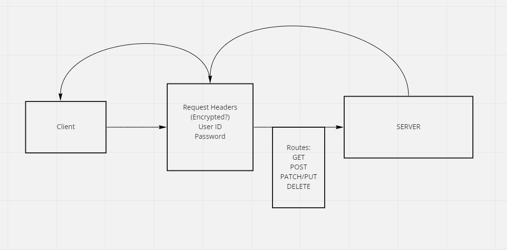

# basic-auth

index.js is the entry point
- conect to the database
- require the server and start it

server.js is the service wiring
- exports an express app/server and a start method.

## Authentication Modules

Keep your authentication related files in a folder called /auth so they are independent of the server itself.

Extract the authentication logic for /signin as middleware.
Create a new node module.
Interact with the headers and the users model.
Add the user record (if valid) to the request object and call next().
Call next() with an error in the event of a bad login.

## Sequelize Model

Extract the Sequelize Model into a separate module.
Model the user data.
Add a before-create hook in the model … Before we save a record:
Hash the plain text password given before you save a user to the database.
Create a method in the schema to authenticate a user using the hashed password.

## Routes

**/signup**

Create a module to house all of routes for the authentication system.
Create a POST route for /signup
Accepts either a JSON object or FORM Data with the keys “username” and “password”.
Creates a new user record in a Postgres database.
Returns a 201 with the created user record.

**/signin**

Create a POST route for /signin.
Use your basic authentication middleware to perform the actual login task.
router.post('/signin', basicAuth, (req,res) => {});
When validated, send a JSON object as the response with the following properties:
user: The users’ database record

## Testing

You should manually test your routes using httpie from the command line or an application such as Postman or Insomnia. Additionally, you are required to write automated tests as well:

POST to /signup to create a new user
POST to /signin to login as a user (use basic auth)
Need tests for auth middleware and the routes
Does the middleware function (send it a basic header)
Do the routes assert the requirements (signup/signin)
This is going to require more “end to end” testing that you’ve done in the past
To test signin, your tests actually need to create a user first, then try and login, so there’s a dependency built in

## Visual Validation

We have deployed a web application that’s designed to test your API. This is a good way to ensure that your API works as expected. There’s nothing to “turn in” here, this is provided for your benefit.

Open this Web Application
Click the “Module 3 (AUTH)” / Basic Auth link
In the form at the top of the page, enter the URL to your Authentication Server
If your lab is working, this app will show your user record after you login

## Installation

to install run `git@github.com:ryanyinlee/api-server.git`

`cd` basic-api-server

run `npm init -y`

`npm i dotenv express jest lint node pg router routes sequelize sequelize-cli sqlite3 supertest bcrypt base-64`

## Usage

`npm start` to run server

`npm test` to test server in terminal

## Routes

CRUD

**People**

- router.get('/people', read)
- router.get('/people/:id', read)
- router.post('/people', create)
- router.patch('/people/:id', update)
- router.delete('/people/:id', remove)

## Current Deploys/GitHub Repository

GitHubRepository

https://github.com/ryanyinlee/basic-auth

Dev Branch:

https://ryanyinlee-basic-auth.herokuapp.com/

Main/Production - Due to Heroku limitations this hasn't been used. Just running dev.

## UML

## Credits

I didn't have any lab help so in order to figure out the structure I consulted:

daniel-jacks' and metty82

https://stackoverflow.com/questions/9177049/express-js-req-body-undefined

Helped me past a bug where request.body was undefined